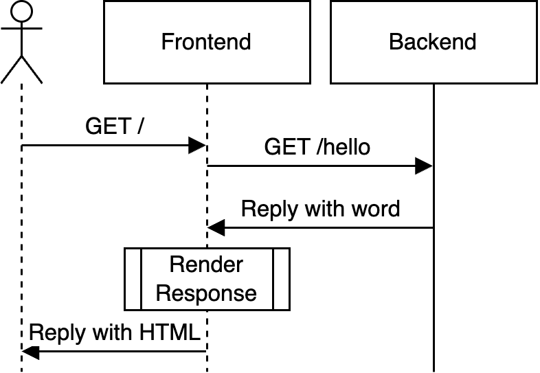

# ⛴️ kubernetes-getting-started

This is an example repository to introduce you to Kubernetes. It covers core concepts and leaves you with a solid foundation, from which you can build your own app or extend your Kubernetes knowledge.

## Prerequisites

All of the shell commands mentioned in this document are meant to be run from the repository's root folder.

### Knowledge

- Basic knowledge of docker, mainly an understanding of images and containers
- Basic knowledge of web development
- Being able to use a terminal

### Software

- macOS, Linux or Windows with [WSL2](https://learn.microsoft.com/en-us/windows/wsl/install)
- [Docker](https://www.docker.com) for building images
- [kind](https://kind.sigs.k8s.io) for setting up a local cluster
- [kubectl](https://kubernetes.io/docs/reference/kubectl) for interacting with the cluster
- Optional: [k9s](https://k9scli.io) for easier troubleshooting and for viewing the cluster
- Optional: [gnu-make](https://www.gnu.org/software/make/) for using the provided [Makefile](./Makefile)

## 🏁 Introduction

Examine the two folders [backend](./backend/) and [frontend](./frontend/).

[backend](./backend/) contains a NodeJS application that exposes a `/hello` endpoint. The endpoint returns a random word from a predefined list each time it is called.

[frontend](./frontend/) also contains a NodeJS application that serves a website where a random word from [backend](./backend/) is presented to the user.

A user request will be handled as follows:


What is Kubernetes?

Kubernetes is a container orchestrator. It manages communication between containers, scaling containers, DNS, container lifecycle and much more. Kubernetes itself is made up of many smaller components although when talking about "the Kubernetes way", Kubernetes is more commonly associated with a set of principles that it is with a piece of software. Kubernetes is mostly used to deploy a containerized microservices architecture. It is itself very flexible an can be adapted to face almost all system deployment challenges.

### Kubernetes Components

The biggest unit in Kubernetes is the cluster. A cluster is made up of a collection of nodes (which are basically just worker machines). A node hosts a collection of pods which again are a collection of associated containers, although it is rather common that a pod only contains a single container. This container can be compared to a familiar docker container.

## Obtaining a cluster

For development purposes, you are going to need a cluster. You can obtain a cluster in one of the following ways.

- From hyperscalers such as AWS, GCP, AKS, AliCloud etc.
  - this is usually very expensive but there is a list for [obtaining free trial clusters for a lot of different hyperscalers](https://github.com/learnk8s/free-kubernetes)
- From "Kubernetes as a Service" providers such as [Gardener](https://gardener.cloud) or [Rancher](https://www.rancher.com)
  - this is typically reserved for enterprise customers with high demands as these solutions scale out to hundreds, thousands or even tens of thousands of clusters
- Locally with
  - [Kind](https://kind.sigs.k8s.io)
  - [Minikube](https://minikube.sigs.k8s.io/docs/)

We will be using kind in this example.

Staring a local Kubernetes cluster with kind is as simple as running:

```bash
kind create cluster
```

For this demo, we need to create a slightly more specialized cluster. Create one by running

```bash
kind create cluster --config kind-config.yaml
```

or by using the Makefile (`make create-kind-cluster`).

This creates a cluster with a name (`word-app-demo`) and a port forwarding configuration to access our application later in this guide.

## Deploying the application

To deploy the application, its services (ie. frontend and backend) have to be containerized first. Luckily, this example provides us with a Dockerfile for each component.

> [!TIP]
> If you are not interested in deploying the application right away, feel free to skip ahead to the [concepts](#concepts) section.

### Building the images

Issue

```bash
docker build -t word-app-frontend -f ./frontend/Dockerfile ./frontend
docker build -t word-app-service -f ./backend/Dockerfile ./backend
```

to build the images locally.

Next they have to be inserted into the kind cluster.

### Loading the images into the kind cluster

Issue

```bash
kind load docker-image word-app-frontend --name word-app-demo
kind load docker-image word-app-service --name word-app-demo
```

to load the images into the kind cluster.

### Retrieve kubeconfig

To interact with the Kubernetes cluster via `kubectl` (and other similar tools). You need to retrieve a so-called `kubeconfig` from the cluster. It contains values such as the hostname of the cluster along with some keys for verifying authority when executing actions on the cluster.

Retrieving your kubeconfig is usually a process that is specific to your provider (see [Obtaining a cluster](#obtaining-a-cluster)). In our case, Kind provides an easy way of retrieving your kubeconfig:

```bash
kind get kubeconfig --name word-app-demo > kind-kubeconfig.yaml
```

Feel free to take a look at the kubeconfig.

Finally, the `KUBECONFIG` environment variable has to be set to the retrieved kubeconfig, to let other tools know where to find your desired kubeconfig.

Do this with

```bash
export KUBECONFIG=$PWD/kind-kubeconfig.yaml
```

> [!CAUTION]
> In a production environment, keep a good overview of your kubeconfigs, accidentally committing them to a public repository could leave an attacker with easy administrative access to your cluster. Be sure to use a timeout for kubeconfigs in a production environment.

### Applying the deployment

There is only one step left, actually deploying the application. To do this, examine the files contained in [`./manifests/`](./manifests/). Focus on the [`./manifests/frontend.yaml`](./manifests/frontend.yaml) and [`./manifests/backend.yaml`](./manifests/backend.yaml) files. They will be explained later in this guide. For now, we will simply apply the entire manifest folder to the cluster because it contains additional files that will also be explained later in this guide.

```bash
kubectl apply -f ./manifests/
```

> [!NOTE]
> The order in which the manifests are applied is completely irrelevant. This is because of one of Kubernetes core concepts, self healing.

At this point, you can visit [localhost:8080](http://localhost:8080) and examine the running application.

Feel free to explore the [Makefile](./Makefile) to learn more about how easy deploying with Kubernetes is.

## Concepts

### Container

A container is like a virtual machine. The only difference is, that it does not contain an entire operating system but rather uses most of the underlying operating system components. Therefore, it contains only application-relevant data along with the application dependencies, libraries and tools.

### Pod

In Kubernetes, a Pod abstracts one or multiple containers. The abstraction is necessary because multiple containers might need to directly communicate with each other and a Pod enables that functionality as it allows multiple containers to be treated as one unit.

### Node

In Kubernetes, a Node hosts multiple Pods. You can think of the Node being an actual machine that runs some Kubernetes infrastructure to be able to host Pods. The process of assigning Pods to Nodes is called scheduling.

### Deployment

In Kubernetes, a Deployment manages several identical Pods. In a deployment, you specify how a Pod should look like, what image it should use, and what environment variables should be set. A Deployment also enables the self-healing functionality of Pods, as Pods are by definition ephemeral. If you delete a Pod in a Deployment, it will be brought back immediately.

### Service

In Kubernetes, a Service enables Pods to be reachable from other Pods or even from outside the Cluster. A Service is attached to a pod and defines one or multiple exposed endpoints. Whenever you want to talk to a pod in a cluster you need to access it through its Service. Two types of Services are distinguished, Internal Services and External Services. Internal Services can only be reached from inside the cluster. External Services are equipped with a public IP address and can therefore be reached from outside the cluster.

### ConfigMap

In Kubernetes, A ConfigMap stores the general configuration for your applications. It can be consumed as environment variables, files in volumes and some other ways.

### Secret

In Kubernetes, A Secret is very similar to a ConfigMap. The only difference is that a Secret is encrypted and can get information through more ways than just static configurations in a ConfigMap.

## Further learning

- Kubernetes Tutorial for Beginners [Link](https://youtu.be/X48VuDVv0do)
- Kubernetes Documentation [Link](https://kubernetes.io/docs/concepts/overview/)